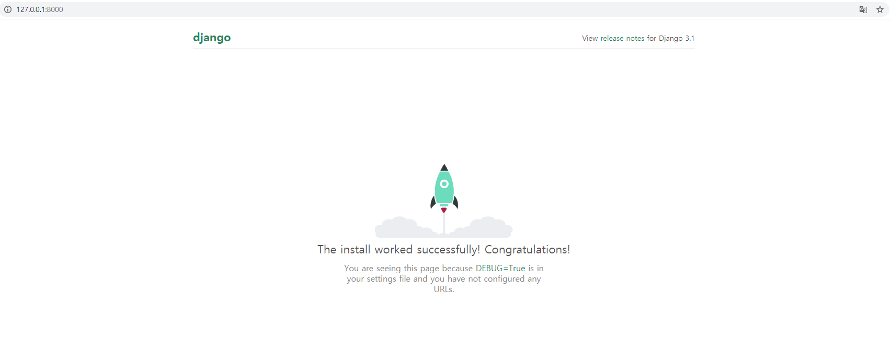
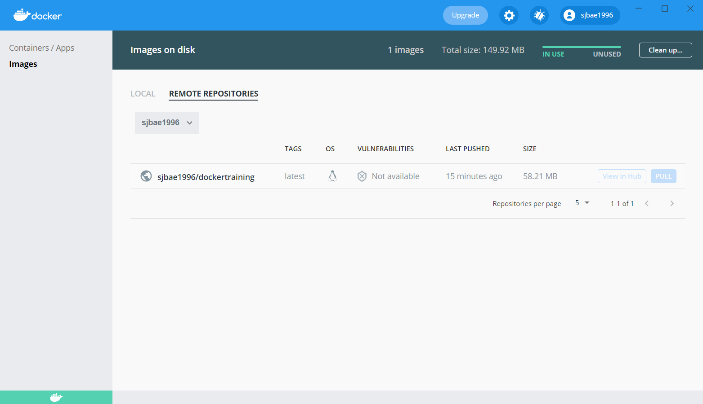

## About Project : DockerTraining

- Run Screen  
<p align="center"></p>  
<p align="center"></p>  

- I made an web application & docker image for studying  
  * Docker Image : https://hub.docker.com/repository/docker/sjbae1996/dockertraining/general

- What I used for this project is below  
  * Django (Server)  
    * DB : SQLite
  * Docker (Server Distribution)  
  * Visual Studio Code (IDE)

- How to run the server (Reference : Docker / Port : 8000)
```
docker pull sjbae1996/dockertraining  
docker run -d -p 8000:8000 sjbae1996/dockertraining
```

- Thanks a lot
